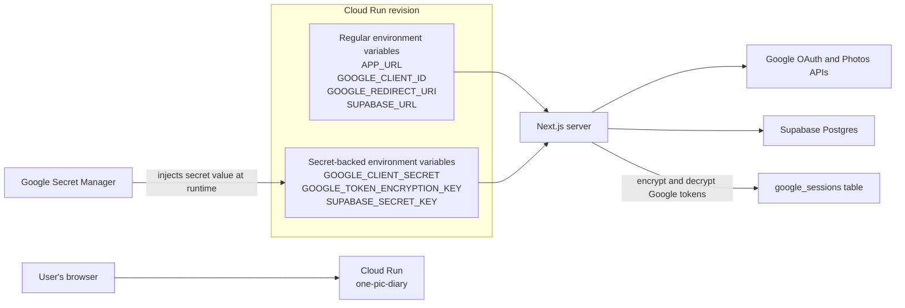
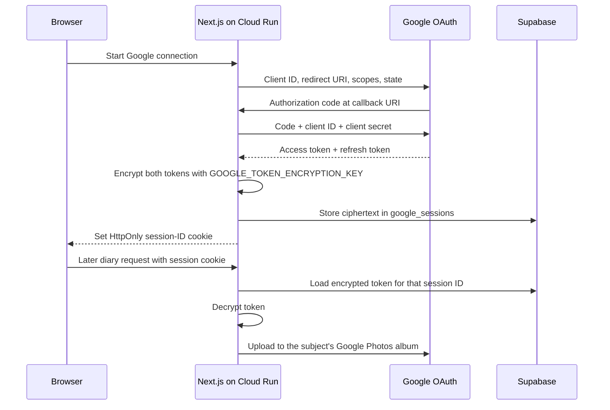

# Cloud Run environment variables and secrets

This document records how 1PicDiary's runtime configuration is split between
Cloud Run environment variables and Google Secret Manager.

## The relationship



An **environment variable** is the name through which the running Next.js
server reads a configuration value, such as `process.env.GOOGLE_CLIENT_SECRET`.

A **Secret Manager secret** stores a sensitive value outside the container.
Cloud Run maps that secret to an environment-variable name when it starts a
revision. The application still reads an environment variable; it does not
contact Secret Manager directly.

For example:

```text
Secret Manager secret: google-client-secret
             mapped to: GOOGLE_CLIENT_SECRET
             read by app: process.env.GOOGLE_CLIENT_SECRET
```

The secret's name and its value are different. Entering
`google-token-encryption-key` as a plain value gives the application those
literal characters. It does not retrieve the secret.

## Current variables

| Cloud Run variable | Sensitive? | Source | Purpose |
| --- | --- | --- | --- |
| `APP_URL` | No | Regular value | The one public origin users should use. Requests received through another Cloud Run hostname redirect here. Recommended value: `https://one-pic-diary-844649524292.us-central1.run.app`. Leave unset locally. |
| `GOOGLE_CLIENT_ID` | No | Regular value | Identifies the 1PicDiary OAuth client to Google. It is included in browser redirects and is not a password. Current client ends in `apps.googleusercontent.com`. |
| `GOOGLE_REDIRECT_URI` | No | Regular value | Exact callback URL Google sends the authorization code to. Production value: `https://one-pic-diary-844649524292.us-central1.run.app/api/auth/google/callback`. It must exactly match an authorized redirect URI in Google Auth Platform. |
| `SUPABASE_URL` | No | Regular value | Base URL of the Supabase project used for subjects, diaries, and Google sessions. Current project URL: `https://hirnszmzajtnqvkdhjab.supabase.co`. |
| `GOOGLE_CLIENT_SECRET` | Yes | Secret Manager: `google-client-secret` | Proves the server is the owner of the Google OAuth client when exchanging or refreshing tokens. Never expose it to browser code. |
| `GOOGLE_TOKEN_ENCRYPTION_KEY` | Yes | Secret Manager: `google-token-encryption-key` | A base64-encoded 32-byte AES-256 key used by Next.js to encrypt Google access and refresh tokens before writing them to Supabase. Keep the same value across revisions. |
| `SUPABASE_SECRET_KEY` | Yes | Secret Manager: `supabase-secret-key` | Privileged server key used to access tables protected from public clients, including `subjects`, `diaries`, and `google_sessions`. It currently starts with `sb_secret_`. |

The code temporarily accepts `SUPABASE_SERVICE_ROLE_KEY` as a legacy fallback,
but new configuration should use `SUPABASE_SECRET_KEY`.

None of these names should start with `NEXT_PUBLIC_`. Every value is read by
server-side code. A `NEXT_PUBLIC_` prefix can cause Next.js to bundle the value
into browser JavaScript.

## Production status checked on October 7, 2026

The active Cloud Run revision has the three regular Google/Supabase variables
and all three secret mappings listed above. `APP_URL` was not present when this
configuration was checked. Add it with the recommended canonical URL if all
alternate Cloud Run hostnames should redirect to one hostname.

## Current Secret Manager mapping

| Secret Manager name | Cloud Run environment variable | Version |
| --- | --- | --- |
| `google-client-secret` | `GOOGLE_CLIENT_SECRET` | `latest` |
| `google-token-encryption-key` | `GOOGLE_TOKEN_ENCRYPTION_KEY` | `latest` |
| `supabase-secret-key` | `SUPABASE_SECRET_KEY` | `latest` |

The Cloud Run revision service account is:

```text
844649524292-compute@developer.gserviceaccount.com
```

It needs the **Secret Manager Secret Accessor** role for all three secrets.

## Where to set them in the Cloud Run UI

1. Open Google Cloud Console and select project `picdiary-508103`.
2. Open **Cloud Run** and select **one-pic-diary**.
3. Click **Edit & deploy new revision**.
4. Open **Containers**, then **Variables & Secrets**.
5. Add non-sensitive settings as regular environment variables.
6. Add each sensitive setting with **Reference a secret**, select the Secret
   Manager name, choose version `latest`, and enter the Cloud Run environment
   variable name from the mapping table above.
7. Deploy the revision and confirm the latest revision receives 100% of traffic.

For `GOOGLE_TOKEN_ENCRYPTION_KEY`, the correct configuration is:

```text
Environment variable: GOOGLE_TOKEN_ENCRYPTION_KEY
Source/type:          Secret
Secret:               google-token-encryption-key
Version:              latest
```

## Local development equivalent

Local development does not automatically read Google Secret Manager. Put the
actual values in `.env.local`, which is ignored by Git:

```bash
APP_URL=
GOOGLE_CLIENT_ID=actual-client-id
GOOGLE_CLIENT_SECRET=actual-client-secret
GOOGLE_REDIRECT_URI=http://localhost:3001/api/auth/google/callback
GOOGLE_TOKEN_ENCRYPTION_KEY=actual-base64-key
SUPABASE_URL=https://your-project.supabase.co
SUPABASE_SECRET_KEY=actual-sb-secret-key
```

Use the port on which the local server is actually running. The local redirect
URI must also be registered in the same Google OAuth client.

## Token and session flow



The browser receives only an opaque, HttpOnly session ID. Google tokens remain
encrypted in Supabase and are decrypted only inside the Next.js server.

## Rotation and troubleshooting

- Changing `GOOGLE_CLIENT_SECRET` requires updating its Secret Manager value.
  Existing Google refresh tokens normally remain usable, but new OAuth exchanges
  must use the current client secret.
- Changing `SUPABASE_SECRET_KEY` requires updating Secret Manager before the old
  Supabase key is revoked.
- Changing `GOOGLE_TOKEN_ENCRYPTION_KEY` makes existing encrypted Google sessions
  unreadable. Keep it stable unless token re-encryption is implemented; otherwise
  users must reconnect Google Photos.
- `redirect_uri_mismatch` means `GOOGLE_REDIRECT_URI` and the Google OAuth
  client's authorized redirect URI do not match exactly, including scheme,
  hostname, port, path, and trailing slash.
- If Cloud Run shows the secret name under **Value** instead of showing a secret
  reference, the mapping is wrong.
- After every configuration change, verify the new revision is ready and receives
  100% of traffic.
